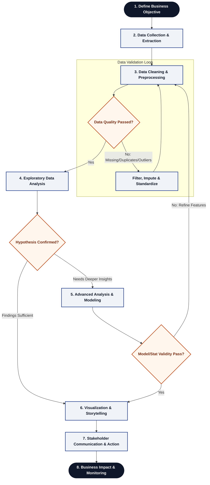

```mermaid
flowchart TD
    %% Node Styles
    classDef step fill:#f0f4f8,stroke:#1e3a8a,stroke-width:2px,color:#0f172a,font-weight:600;
    classDef decision fill:#fff7ed,stroke:#c2410c,stroke-width:2px,color:#7c2d12,font-weight:600;
    classDef terminal fill:#0f172a,stroke:#0f172a,stroke-width:2px,color:#ffffff,font-weight:600;

    A([1. Define Business Objective])
    B[2. Data Collection & Extraction]
    C[3. Data Cleaning & Preprocessing]
    D{Data Quality Passed?}
    E[Filter, Impute & Standardize]
    F[4. Exploratory Data Analysis]
    G{Hypothesis Confirmed?}
    H[5. Advanced Analysis & Modeling]
    I{Model/Stat Validity Pass?}
    J[6. Visualization & Storytelling]
    K[7. Stakeholder Communication & Action]
    L([8. Business Impact & Monitoring])
    
    A -->B
    B-->C
    subgraph Data Validation Loop
        C --> D
        D -->|No: Missing/Duplicates/Outliers| E
        E --> C
    end

    D -->|Yes| F
    
    F --> G
    G -->|Needs Deeper Insights| H
    G -->|Findings Sufficient| J

    H --> I
    I -->|No: Refine Features| C
    I -->|Yes| J

    J --> K
    K --> L

    class A,L terminal;
    class B,C,E,F,H,J,K step;
    class D,G,I decision;
```