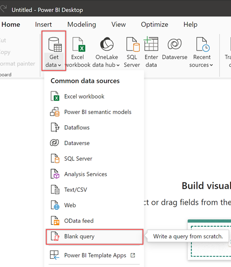
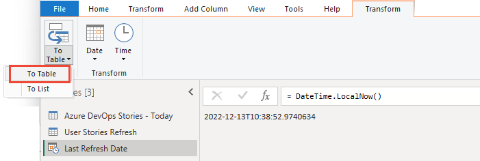
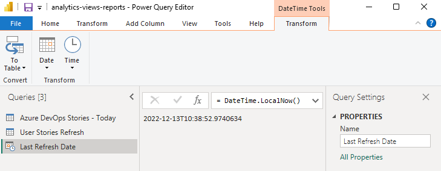
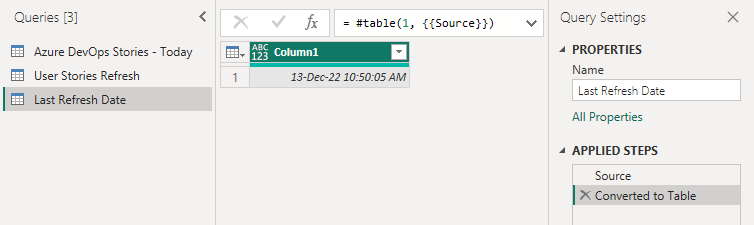
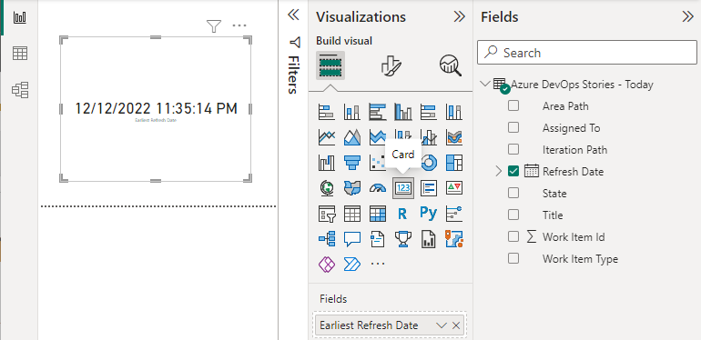
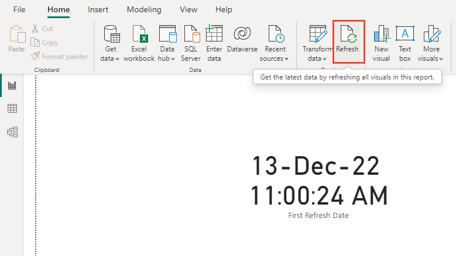

# Show last refresh date to Power BI report

* [Learn Microsoft](https://learn.microsoft.com/en-us/azure/devops/report/powerbi/add-last-refresh-time?view=azure-devops&tabs=private)

## Add the last refresh date based on an Analytics view

To add a column with the last refresh date of the dataset, do the following steps:

1. Open **Power BI Desktop** on your computer.

2. Select **File** from the top menu, then choose **Open**.

3. Go to the location where your *.pbix* file is stored, select the file, and select **Open**.

   The *.pbix* file contains the data model and report layout  associated with your view. Once loaded, you can begin making  modifications, such as adding a last refresh date or customizing the  report further.

4. In the **Queries** section of the ribbon, select **Transform data** > **Transform data**.

5. Select **Advanced Editor**.

   If you didn't modify the query, review the following examples with specific table values matching your Analytics view.

Private view

```bash
let
    Source = AzureDevOps.AnalyticsViews("{OrganizationName}", "{ProjectName}", []),
    #"Private Views_Folder" = Source{[Id="Private Views",Kind="Folder"]}[Data],
    #"{AnalyticsViewsID_Table}" = #"Private Views_Folder"{[Id="{AnalyticsViewsID}",Kind="Table"]}[Data],
    #"Added Refresh Date" = Table.AddColumn(#"{AnalyticsViewsID_Table}", "Refresh Date", each DateTimeZone.FixedUtcNow(), type datetimezone)
in
    #"Added Refresh Date"
```

Shared view

```bash
let
    Source = AzureDevOps.AnalyticsViews("{OrganizationName}", "{ProjectName}", []),
    #"{AnalyticsViewsID_Table}" = Source{[Id="{AnalyticsViewsID}",Kind="Table"]}[Data]
in
    #"{AnalyticsViewsID_Table}"
```

6. Modify the query according to the following syntax.

Private view

```bash
let
    Source = AzureDevOps.AnalyticsViews("{OrganizationName}", "{ProjectName}", []),
    #"Private Views_Folder" = Source{[Id="Private Views",Kind="Folder"]}[Data],
    #"{AnalyticsViewsID_Table}" = #"Private Views_Folder"{[Id="{AnalyticsViewsID}",Kind="Table"]}[Data],
    #"Added Refresh Date" = Table.AddColumn(#"{AnalyticsViewsID_Table}", "Refresh Date", each DateTimeZone.FixedUtcNow(), type datetimezone)
in
    #"Added Refresh Date"
```

7. Select **Done**.
8. Select **Close & Apply** to immediately refresh the dataset.


## Add last refresh date based on a Power BI or OData query

To add the last refresh date based on a Power BI or OData query, do the following steps:

1. From Power BI, select **Get data** > **Blank Query**.



2. Rename the query to *Last Refreshed Date*, and then enter the following formula into the function bar.

```bash
=DateTime.LocalNow()
```



3. To convert the date data to a table format, choose **To Table** > **To Table**.



A single column appears with the date.




***Tip***

If the **To Table** option isn't available, you can use the following alternative steps to add the last refresh date and time to your reports:

1. Select the **Home** tab and select **Get Data**. Choose **Blank Query** from the options.
2. In the Queries pane, right-select the new query and select **Advanced Editor**.
3. To create a table with the current date and time, replace the existing code with the following code:

```bash
let
Source = #table(
    {"Last Refresh Date"}, 
    {{DateTime.LocalNow()}}
)
in
Source
```


4. From the **Transform** menu, select the **Data Type** dropdown menu and select **Date/Time** option.
5. Rename **Column1** to something more meaningful, such as *Last Refresh Date*.
6. From the Home menu, select **Close and Apply**.

## Add a card to a report with the Refresh Date

To add a card with the last refresh date to your reports, under **Visualizations**, select **Card**, and add **Refresh Date** or **Last Refresh Date** to **Fields**.



## Refresh data

Choose **Refresh** to refresh report page data and the data model. After all queries are updated, the card refreshes with the latest date.




# Reference

* Microsoft Learn - [Show last refresh date to Power BI report](https://learn.microsoft.com/en-us/azure/devops/report/powerbi/add-last-refresh-time?view=azure-devops&tabs=private)
