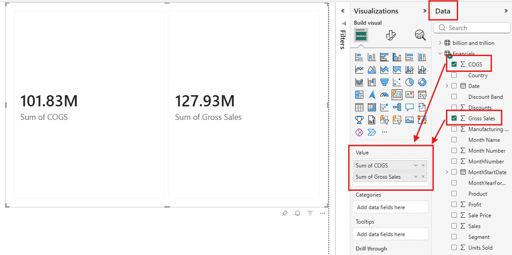

# Cards Visuals

Card visuals display a single fact or data point prominently. The card  visual supports both single-card and multi-card layouts, and can include images and detailed reference values within the visual. Use cards when a single number, such as total sales or market share, is the most  important thing to track.

The **card visual** in Power BI displays key metrics in a flexible, visually appealing format. Each card shows a measure value  with optional callout images, reference labels, and supporting details. 

## Create a card visual

1. In the **Visualizations** pane, select the **Build visual** tab, then select the **Card** visual from the visual gallery.
2. Add a measure or any data column to the **Values** field well.

# References

* [Create a card visual in Power BI](https://learn.microsoft.com/en-us/power-bi/visuals/power-bi-visualization-card)

